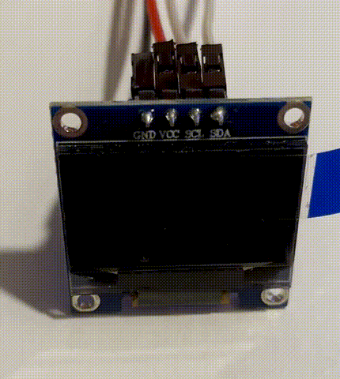

<div align="center">

# Tram Departure Display

**Real-time tram departures on a battery-powered ESP32 OLED display**

[](https://www.espressif.com/)
[](https://platformio.org/)
[](LICENSE)

<br>



<br>

**Live departure times** · **Delay tracking** · **15+ months battery life**

---

</div>

## Overview

A compact embedded system that fetches live departure times for German public transit and displays them on a crisp OLED screen. Configure your station, filter by direction, and never miss your tram again.

<table>
<tr>
<td width="50%">

### Features

- **Real-time data** from the German Rail API
- **Smart filtering** — shows only relevant directions
- **Delay indicators** — see if your tram is running late
- **Countdown display** — minutes until departure
- **Power efficient** — deep sleep between updates

</td>
<td width="50%">

```
┌────────────────────────────┐
│  17:26+3          in 4'    │
│  17:34            in 12'   │
│  17:42+1          in 19'   │
└────────────────────────────┘
```

</td>
</tr>
</table>

## Hardware

| Component | Specification |
|-----------|---------------|
| Microcontroller | ESP32 DOIT DevKit v1 |
| Display | SSD1306 OLED 128×64 |
| Interface | I2C (SDA: GPIO 21, SCL: GPIO 22) |
| Power | 3× AAA batteries + MCP1700 regulator |

### Wiring Diagram

```
                    ┌─────────────────────────────────────────┐
                    │              ESP32 DevKit               │
                    │                                SSD1306  │
                    │                               ┌──────┐  │
                    │  3V3 ○────────────────────────│ VCC  │  │
                    │                               │      │  │
                    │  GND ○───┬────────────────────│ GND  │  │
                    │          │                    │      │  │
    RESET BUTTON    │          │                    │      │  │
        ○───────────┼──────────┘                    │      │  │
       ╱                                            │      │  │
        ○───────────┼── EN  ○                       │      │  │
                    │                               │      │  │
                    │  GPIO21 ○─────────────────────│ SDA  │  │
                    │                               │      │  │
                    │  GPIO22 ○─────────────────────│ SCL  │  │
                    │                               └──────┘  │
                    └─────────────────────────────────────────┘

           POWER SUPPLY (3× AAA → 3.3V)
    ┌─────────────────────────────────────────────────────────┐
    │                                                         │
    │   3× AAA          MCP1700-3302E                        │
    │   (4.5V)          ┌─────────┐                          │
    │     +             │         │                          │
    │     ├────┬────────┤ VIN     │                          │
    │     │   ─┴─       │      VOUT├───────────→ ESP32 3V3   │
    │    ─┴─  ───  1µF  │         │        │                 │
    │    ───   │        │     GND │       ─┴─                │
    │     │    │        └────┬────┘       ───  1µF           │
    │     └────┴─────────────┴─────────────┴──→ ESP32 GND    │
    │     -                                                   │
    └─────────────────────────────────────────────────────────┘
```

### Component Details

| Part | Description |
|------|-------------|
| **Reset Button** | Momentary push button between EN and GND — wakes ESP32 from deep sleep |
| **MCP1700-3302E** | Low-dropout 3.3V regulator (250mA max, ideal for battery operation) |
| **1µF Capacitors** | Ceramic caps on VIN and VOUT for regulator stability |
| **3× AAA** | Provides ~4.5V nominal (works down to ~3.6V with MCP1700) |

## Quick Start

### 1. Clone & Configure

```bash
git clone https://github.com/elias-greve/mc-train-departure.git
cd mc-train-departure
```

Copy the secrets template and configure it for your station:

```bash
cp src/secrets.h.example src/secrets.h
```

Edit `src/secrets.h` with your settings (see [Customization](#customization) below).

### 2. Build & Upload

Using **PlatformIO CLI**:

```bash
pio run -t upload
```

Or use the PlatformIO IDE upload button in VS Code.

### 3. Monitor

```bash
pio device monitor
```

## Project Structure

```
mc-train-departure/
├── src/
│   ├── main.cpp              # Application logic
│   ├── secrets.h             # WiFi credentials (git-ignored)
│   └── secrets.h.example     # Credentials template
├── include/                  # Header files
├── lib/                      # Custom libraries
├── platformio.ini            # Build configuration
└── README.md
```

## Customization

All user settings are in `src/secrets.h`:

```cpp
// WiFi credentials
const char* WIFI_SSID = "your-network";
const char* WIFI_PASSWORD = "your-password";

// Station ID - find yours at https://v6.db.transport.rest/locations?query=YOUR_STATION
const char* STATION_ID = "YOUR_STATION_ID";

// Comma-separated list of direction keywords to filter for
// Only departures containing one of these strings will be shown
// Leave empty ("") to show all departures
const char* DIRECTION_FILTER = "Hauptbahnhof,Marktplatz";
```

### Finding Your Station ID

1. Open your browser and go to:
   ```
   https://v6.db.transport.rest/locations?query=YOUR_STATION_NAME
   ```
   Replace `YOUR_STATION_NAME` with your station (e.g., `Hauptbahnhof` or `Münsterplatz`).

2. Find your station in the JSON response and copy the `id` field.

### Filtering Directions

The `DIRECTION_FILTER` setting lets you show only departures heading in specific directions:

- Use partial matches: `"Haupt"` will match `"Hauptbahnhof"`
- Separate multiple filters with commas: `"Hauptbahnhof,Marktplatz"`
- Leave empty to show all departures: `""`

### Other Settings

In `src/main.cpp`:

| Setting | Default | Description |
|---------|---------|-------------|
| `awakeTimeMs` | `30000` | Display on-time before sleep (ms) |

## Dependencies

Managed automatically by PlatformIO:

- `ArduinoJson` — JSON parsing
- `Adafruit GFX Library` — Graphics primitives
- `Adafruit SSD1306` — Display driver

## How It Works

```
┌─────────┐    ┌─────────┐    ┌─────────┐    ┌─────────┐
│  Boot   │───►│  WiFi   │───►│  Fetch  │───►│ Display │
│         │    │ Connect │    │  Data   │    │  30sec  │
└─────────┘    └─────────┘    └─────────┘    └────┬────┘
                                                  │
                    ┌─────────┐                   │
                    │  Deep   │◄──────────────────┘
                    │  Sleep  │
                    └─────────┘
```

1. **Boot** — Initialize display, show progress
2. **Connect** — Join WiFi network
3. **Sync** — Get current time via NTP
4. **Fetch** — Query departures from API
5. **Display** — Show next 3 matching trams
6. **Sleep** — Enter deep sleep to save power

## Battery Life Estimation

Detailed power analysis for the 3× AAA battery configuration.

### Component Current Draw

| Component | Active | Deep Sleep | Notes |
|-----------|--------|------------|-------|
| **ESP32** | ~80 mA | ~10 µA | WiFi TX peaks at ~240 mA |
| **SSD1306 OLED** | ~20 mA | ~0 µA | Varies with content (~50% pixels lit) |
| **MCP1700 Regulator** | ~4 µA | ~4 µA | Quiescent current |
| **Total Active** | **~100 mA** | — | Average during operation |
| **Total Sleep** | — | **~15 µA** | Deep sleep with display off |

### Power Cycle Breakdown

Each button press triggers one complete cycle:

| Phase | Duration | Current | Energy (mAh) |
|-------|----------|---------|--------------|
| Boot + WiFi Connect | ~5 sec | 120 mA | 0.167 |
| NTP Sync | ~2 sec | 100 mA | 0.056 |
| HTTPS Request | ~3 sec | 110 mA | 0.092 |
| Display Active | 30 sec | 25 mA | 0.208 |
| **Total per cycle** | **~40 sec** | — | **~0.52 mAh** |

> **Note:** WiFi is disabled after data fetch, so the 30-second display period only draws ~25 mA (ESP32 idle + OLED).

### Estimated Battery Life

**Typical usage: 3 activations per day**

```
Daily consumption:
  Active:  3 cycles × 0.52 mAh = 1.56 mAh
  Sleep:   15 µA × 24 h        = 0.36 mAh
  Total:                       = 1.92 mAh/day

Battery life:
  900 mAh ÷ 1.92 mAh/day ≈ 470 days (~15 months)
```

> **Note:** Assumes ~900 mAh usable capacity from 3× AAA alkaline batteries (accounting for 3.6V voltage cutoff).

| Usage Pattern | Cycles/Day | Battery Life (Alkaline) |
|---------------|------------|-------------------------|
| Minimal (1×/day) | 1 | ~2 years |
| Typical (3×/day) | 3 | **~15 months** |
| Moderate (5×/day) | 5 | ~10 months |
| Heavy (10×/day) | 10 | ~5 months |

### Key Takeaways

- **Sleep current dominates** — At low usage, the 15 µA sleep current determines battery life
- **Theoretical maximum** — If never used: 900 mAh ÷ 0.36 mAh/day ≈ 2,500 days (~7 years)
- **Sweet spot** — 1–5 checks per day yields over a year of battery life

### Tips to Maximize Battery Life

1. **Reduce `awakeTimeMs`** — 15 seconds instead of 30 saves ~0.1 mAh per cycle
2. **Use quality alkaline batteries** — Higher capacity and better voltage retention

---

<div align="center">

Made with caffeine and public transit enthusiasm

</div>
